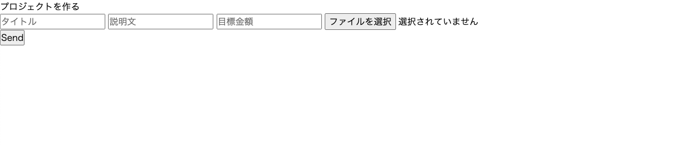

# README

# アプリ名
### Funding

# 概要
クラウドファンディングのプロジェクトを立ち上げたり、支援したりできます。

# 開発状況
- 開発環境

  - 開発言語：  
    - Ruby
  - フレームワーク:  
    - Ruby on Rails  
  - 開発ツール:  
    - Github/AWS S3/Visual Studio Code  
  - データベース：  
    - MySQL  

- 動作概要 URL https://agile-falls-93212.herokuapp.com/

# ログインされる企業様
- 以下のアカウントにてログインをいただければと存じます。
  - mail
    - test@test.com
  - password
    - testtest

# 機能紹介

## 最新６件のプロジェクトが表示されます

## 新規プロジェクトを作成できます

## プロジェクトの詳細が確認できます。目標達成率や支援者数が確認できます。

## プロジェクトへ支援を行うことができます。

 ## Users_table

|Column|Type|Options|
|------|----|-------|
|email|string|null: false, default: ""|
|encrypted_password|string|null: false, default: ""|
|reset_password_token|string||
|reset_password_sent_at|datetime||
|remember_created_at|datetime||

### Association

- has_one :backer
- has_many :posts

 ## Posts_table

|Column|Type|Options|
|------|----|-------|
|title|string||
|text|string||
|image|string||
|target_value|string||

### Association

- belongs_to :user, optional: true
- has_many :backers

 ## Backers_table

|Column|Type|Options|
|------|----|-------|
|address|string|null: false|
|money_value|string|null: false|
|user_id|integer|null: false, foreign_key: true|
|post_id|integer|null: false, foreign_key: true|

### Association

- belongs_to :user
- belongs_to :post